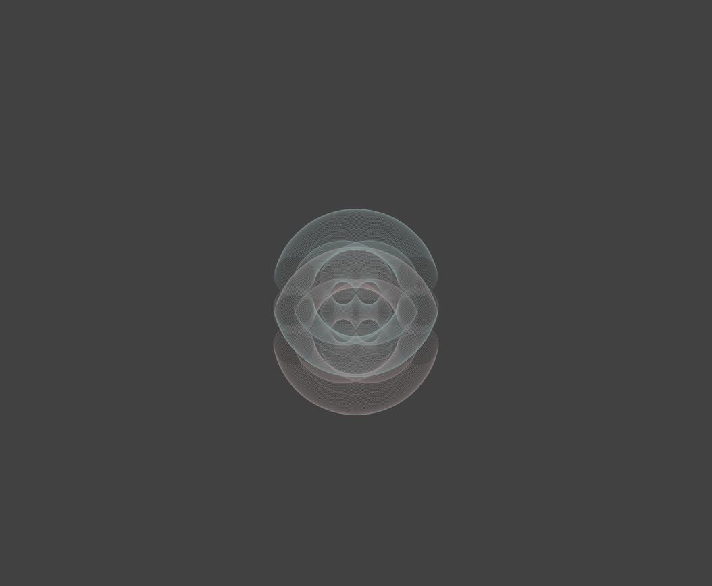

## 〈作品３〉両性具有の美
 >生物たると、無生物たるとを問わず、ある一つの宇宙的な力、二元性を解消して原初の一元性を獲得しようとする、盲目的な力にすべての物質が支配されていることを、わたしたちは驚きの念とともに認めねばならぬであろう。  
 澁澤龍彦 (1984)『夢の宇宙誌』「 アンドロギュヌスについて」河出書房 
 >  

   

　家の近所の定食屋に行った。その定食屋は、徒歩1分もかからない距離にあったのに、存在にすら気づかずに引っ越してきてから1年ほどが経っていた。最近ぼくは、お店にある本棚の写真を撮ることにしている。その定食屋でも同じように写真を撮ろうとした際に、一冊の本のタイトルがふと目に留まった。   
　「両性具有の美」  
　浅学ながら、「両性具有」という言葉をここで初めて知ったぼくは、なぜかその字面に惹かれて、後で意味を調べた。コトバンクによると次の意味らしい。  
>男女両性を備えていること。 特に、心理学的な両性の傾向の体現や、神話や儀式などに現われる原初の全体性を象徴する存在をいう。
> 
　女性性と男性性の双方が、自分の中に内在している状態を、現代ではXジェンダー[^1]と呼ぶ。この状態で、精神はどんなバランスを保っているのだろうか。   
　男女の絶対的な緊張関係に対するさっぱりとした諦めと、その状態を理想化し、そこに自由を見出す意気地のありようから「いき」とは何かを論じた哲学者の九鬼修造は、一人の人間の中に両性が共存することを想定しただろうか。いや、男女という二項の関係と同じように、一人の中の両性の関係は、絶対的な緊張関係のまま混じり合うことはなく、絶え間ない運動の中でバランスを保っているのかもしれない。こればかりは、当事者ではないぼくには本当のところはわかりかねるので、下手なことを言うべきではないだろう。  
　それにしても「両性具有の美」とは、意味を知るとますます心惹かれる本のタイトルである。「対立する二項の共生」[^2]の言い換えは、「両性具有の美」なのかもしれないと、向こう見ずに言ってみたところで口を閉ざそう。[^3]

 [^1]: 正確にはXジェンダーには中性・両性・無性・不定性という分類が存在し、ここではその中の両性のことを指している。
また、男性と女性の生理学的性質を不完全ながら両方とも有して生まれてくる「インターセックス」と呼ばれる人たちも存在するが、身体的な両性の特徴を有するインターセックスと、性自認が男女の双方を有するXジェンダーの両性は同じではないということは念のため記しておく。
 [^2]: 詳しくは次章「対立する二項の共生とは」を参照。
 [^3]: 以上の文章は、2023年5月16日の日記を一部改変したものである。
