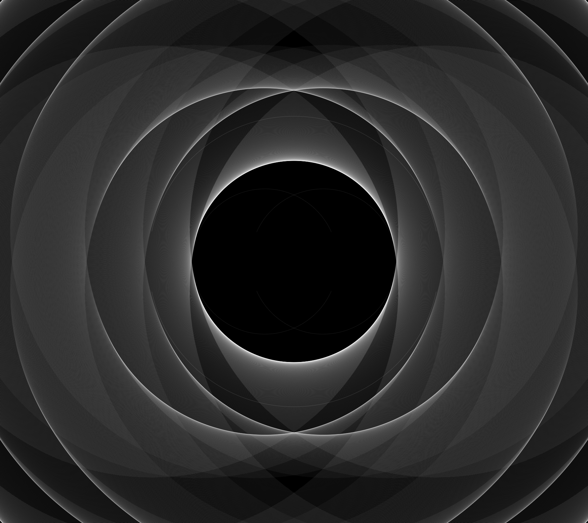

## 作品の成り立ち
>コンピュータは、芸術家や数学者や科学者が以前には知ることのできなかった、予想外で不思議な新しい世界を見せてくれる道具です。またコンピュータは、芸術家でない人にも芸術らしいものにかかわらせてくれます。  
芸術批評家はこれを芸術とはよばないでしょう。しかし私の作品は、私にとっては芸術なのです。[^1] 
クリフォード・A・ピックオーバー
>
　ぼくの作品は基本的に、「対立する二項の共生」という思想的モチーフを投影したシンプルなオブジェクトを最小の構成要素とし、この要素の中心が同一円周上に位置するように複数個配置することによって生まれている。この最小の構成要素は、ぼくが取り組んだ卒業研究「ConvivialChat」[^2]のロゴとして生まれた（経緯の詳細については次々章「対立する二項の共生とは」を参照）。以下がその最小の構成要素だ。  

▼最小の構成要素  
  
[作品リンク](https://neort.io/art/cbnofrc3p9f2v73utfdg?index=11)    

　上記の最小の構成要素の中心が、曼荼羅のように同一円周上に位置するように複数個配置することで、より複雑な模様になる（以下は配置個数が25個)。  

▼配置個数25個（円周上の配置24個＋中央の1個）  
  
[作品リンク](https://neort.io/art/cbnoirc3p9f2v73utgp0?index=10)  

　この作品のアルゴリズムの中の繰り返し回数を上昇させる（配置個数を増やす）と作品の複雑さが増す。  

▼配置個数181個（円周上の配置180個＋中央の1個）  
  
[作品リンク](https://neort.io/art/cbogdm43p9f2v73utlkg?index=9)    

　繰り返し回数を一気に1440へ上昇させると、以下のようになる。画像の解像度のせいで、180回繰り返す方との違いがわかりづらいかもしれないので、お手元のパソコンでリンク先に飛んで実際に見比べてみてほしい。リンク先を開いた後、作品の画面をクリックすると描画が変化する（クリック時に乱数の値が変化する）ので、その変化も鑑賞されたい。  

▼配置個数1441個（円周上の配置1440個＋中央の1個）  
  
[作品リンク](https://neort.io/art/cboid7k3p9f2v73utm4g?index=8)    

　また、このような最小の構成要素を複数個同一円周上に配置して出力された描画を、より高次な1つのオブジェクト（お望みであればメタオブジェクトと呼んでも構わない）だと捉えて、それを再度同一円周上に複数個配置することを試みると、以下のようになる（より正確には以下リンク先の作品は、複数個のメタオブジジェクトの同一円周上への配置を、2パターン重ねて描画している）。

▼メタオブジェクトの配置個数44個（円周上の配置18個＋中央の1個と円周上の配置24個＋中央の1個）  
  
[作品リンク](https://neort.io/art/ccja2043p9f4hhftgn00?index=7)  

　この本に載せた作品（表紙や挿絵も含めて）は全て、最初に紹介した極めて単純な構成要素のみで成り立っている。最小の構成要素の色、大きさ、線の太さ、配置個数や配置の仕方を変えているだけで、それ以外のオブジェクトは一切用いておらず、アルゴリズム自体も極めて単純なものである。ただ、その最小の構成要素には「対立する二項の共生」という思想的モチーフを潜ませている。  
　画家であり美術理論家のパウル・クレーは、著書『造形思考』のなかでこう言っている。
>単純さの中にもまた、豊富さはありうる。であるから、単純であるという勇気が与えられる。（略）わずかなものをもって、精神的に多くのものを創造すること。[^3]
>

ジェネラティブ・アートが、単純さから豊かさを生み出すという芸術の深層に触れさせてくれたと思うのは、ぼくの不遜だろうか。

[^1]: ジョン・ブリッグズ (1995)『フラクタルな世界―科学と芸術にみる新しい美学』深川洋一訳、丸善出版。      
[^2]: ConvivialChatとは、音声発言によって会話に参加する「スピーチ参加者」と主にチャットを用いて会話に参加する「テキスト参加者」が対等に話し合いに貢献できるように、機械音声によるテキスト読み上げ機能、音声発言の文字起こし、読み上げ機能付きリアクションボタンを備えた遠隔会話ツール（Webアプリケーション）である。著者が卒業研究として開発した。    
https://github.com/takahi-ro/ConvivialChat/blob/main/README.md
[^3]: パウル・クレー (2016) 『造形思考(下)』土方定一・菊盛英夫・坂崎乙郎訳、筑摩書房。
